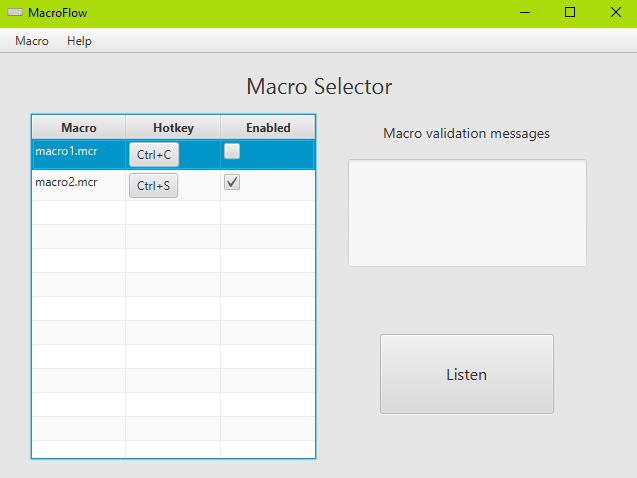
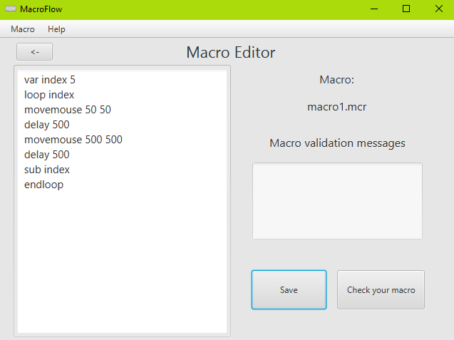

# MacroFLow
Macro flow is a simple tool to create macros, due to simplicity you can create macros very quickly, each of them consists of simple commands described in lower chapters. You can assign a keyboard shortcut to the macro, and when you switch program to listening state, MacroFlow will wait for you to trigger the macro with the right hotkey, when same keyboard shortcut is pressed while macro is under execution, script is terminated. The number of macros the program can listen to is unlimited.

## Interface
interface contains two windows: main and editor. In the main window the user can add macros, set keyboard shortcuts, enable macro for listening and switch the program to "listening" mode. In the editor's window the user can create macros, save, edit existing ones and validate the written script. After closing the window, the program works in the background.
## Screenshots

### Available commands
Every instruction starts with command name, then arguments must be provided 
Eg: delay 500 
Each line can contain only one instruction. 
Available instructions: 
* delay time - suspend macro execution for time milliseconds
* clipboard data - saves to clipboard data in string
* paste - paste data from clipboard, this command is implemented as pressing combination CTRL+V
* var name [initial] - creates variable with initialized with 0 or value initial if provided
* add out in1 in2 - adds two variables (must be defined with command var) and assigns result to out variable out
* sub out in1 in2 - subtracts two variables (must be defined with command var) and assigns result to out variable out
* mul out in1 in2 - multiplies  two variables (must be defined with command var) and assigns result to out variable out
* div out in1 in2 - divides  two variables (must be defined with command var) and assigns result to out variable out
* bigger out in1 in2 - compares two variables (must be defined with command var) and assigns result to out variable out if in1 is bigger than in2 result is 1 otherwise 0
* smaller out in1 in2 - compares two variables (must be defined with command var) and assigns result to out variable out if in1 is smaller than in2 result is 1 otherwise 0
* equal out in1 in2 - compares two variables (must be defined with command var) and assigns result to out variable out if in1 equal to in2 result is 1 otherwise 0
* assign out in - assign in variable to out
* Label name - creates label, you can jump to this instruction by command Jmp label
* Jmp name - jump instruction to label
* If value - if value is not equal to zero program is execution next instruction otherwise is jumps to first endif statement
* endif - closes if statement
* loop value - if value is not equal to zero program is executing inside loop instructions otherwise is jumps to first endloop statement
endloop - closes loop statement
* movemouse xcoord ycoord - moves mouse to position xcoord, ycoord on screen 
* presskey keyname - press keyboard key
* releasekey keyname - release keyboard key
* write string - writes string by pressing keys

### Installing
Compiled Program is MacroFLow\out\artifacts\MacroFlow_jar directory. Program requires the java compiler to have a built-in javafx library. 
To execute program on windwos run "run.bat"

## Built With

### Java 11 - Intellij
* [Javafx](https://gluonhq.com/products/javafx/) - Graphical interface framework
* [Junit](https://junit.org/junit5/) - Java testing code framework
* [Jnativehook](https://github.com/kwhat/jnativehook) - Used to handle global hotkey tracking

## Authors

* **Sylwester Dawida** - *2020* - [Sylwow](https://github.com/Sylwow)

## License

This project is licensed under the MIT License - see the [LICENSE.md](LICENSE.md) file for details

